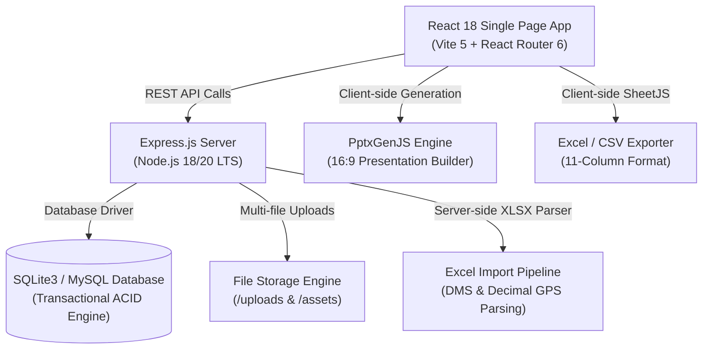

# Media Buzz OOH Operations Management System
## Complete System Documentation & Production Manual

---

## 1. Executive Summary

**Media Buzz OOH Workspace** is an enterprise-grade Out-of-Home (OOH) media inventory management, campaign tracking, proposal generation, and automated presentation engine built specifically for billboard, gantry, unipole, and DOOH media owners in India.

The platform streamlines end-to-end OOH operations:
- **Inventory & Asset Management**: 57+ prime outdoor inventory sites across Ahmedabad and Gujarat with exact specifications, GPS coordinates, and photo assets.
- **Campaign Execution Tracker**: Operational monitoring of printing, mounting, 15-day photo validations, hard copy proof of performance, and billing dispatch.
- **Dynamic Proposal Builder**: Real-time multi-rate calculation (Media Rate + Vendor Rate + Printing Rate + Mounting Rate), discount application, GST (18%) computing, and authentic print-to-PDF letterhead documents.
- **Automated PPT Generation**: One-click generation of 16:9 widescreen client-pitch presentations (`.pptx`) with custom branded cover slides, intro slides, and closing slides.
- **Utility & Electricity Expense Tracker**: Torrent Power and UGVCL meter monitoring, consumer numbers, bill due-date alert triggers, and payment records.
- **Vendor & Client Relationship Management**: Complete vendor service directory (Printing, Mounting, Electrical) and client account portfolios with GST numbers.
- **Financial & Performance Reports**: Executive analytics detailing total booked revenue, net operating yield %, media type revenue distribution, and top client volume.
- **Theme Customization Engine**: Dynamic Dark & Light mode toggle with instant persistence across all pages, tables, and presentation builders.

---

## 2. Technical Architecture



### Technology Stack
| Layer | Technologies Used | Key Responsibilities |
| :--- | :--- | :--- |
| **Frontend UI/UX** | React 18, Vite 5, React Router 6, DM Sans / Playfair Typography | Responsive single-page dashboard, real-time KPI computation, dynamic forms, Light/Dark theme switching. |
| **Presentation Engine** | PptxGenJS v3.12 | Client-side 16:9 widescreen PowerPoint deck generation with embedded custom cover slides and site images. |
| **Backend API** | Node.js (v18/v20), Express.js, CORS, Multer | RESTful API endpoints for Sites, Campaigns, Invoices, Electricity, Vendors, Clients, Users, Settings, and Data Import. |
| **Database Layer** | SQLite3 (`server/data/sc_app.db`) / MySQL Ready | Relational schema with foreign keys, cascading integrity, and transactional seed data. |
| **Import / Export** | SheetJS (`xlsx`) | 11-column Excel parsing, DMS coordinate to decimal conversion, auto-matching by location/ID. |

---

## 3. Module-by-Module Operational Guide

### 3.1. Executive Dashboard (`/dashboard`)
The command center for daily OOH operations:
- **8 Core KPI Counters**: Total Sites Portfolio, Available Sites, Booked Rate, Monthly Gross Revenue, Occupied Inventory, Campaigns Running, Pending Electricity Bills, and Critical Operations Alerts.
- **Needs Attention Today Panel**: Real-time operational flags highlighting overdue mountings, impending 15-day validations, and unbilled active campaigns.
- **Media Type Occupancy Breakdown**: Visual occupancy bars for Gantries, Hoardings, Unipoles, Billboards, and DOOH screens.
- **Auto-Refresh Interval**: Background polling every 45 seconds ensures live synchronization across multiple operators.

### 3.2. Sites Inventory Directory (`/sites`)
Full lifecycle management of physical outdoor advertising structures:
- **Attributes Tracked**: Site Code (`AMD-GT-001`), Area / Landmark, City, Media Type, Size ($W \times H$), Lighting (`BL`, `FL`, `NL`), Monthly Rate (₹), Availability (`Available`, `Occupied`, `Maintenance`, `Booked`), Address, GPS Coordinates, Google Maps link, and Presentation Photos.
- **Presentation Photo Manager**: Upload up to 10 high-resolution photos per site. Photos are automatically cropped and framed in landscape 16:9 aspect ratio for client presentations.
- **Search & Filters**: Instant full-text search across site codes, roads, landmarks, and dropdown filters by City and Media Type.

### 3.3. Campaign Execution Tracker (`/campaigns`)
Complete operations workflow management for booked advertising campaigns:
- **Workflow Stages Tracked**:
  - `Printing Status`: `pending` $\rightarrow$ `in_progress` $\rightarrow$ `completed`
  - `Mounting Status`: `pending` $\rightarrow$ `scheduled` $\rightarrow$ `completed`
  - `15-Day Validation`: Due-date tracking for mid-campaign site photo inspections and lighting verification.
  - `Hard Copy Proof Status`: Physical proof of mounting dispatch to client agency (`pending` / `sent`).
  - `Invoice Status`: `draft` $\rightarrow$ `sent` $\rightarrow$ `paid`
- **Overdue Visual Cues**: Overdue mounting or validation tasks are highlighted with high-contrast red alerts.

### 3.4. Proposal Builder (`/proposals`)
Interactive quote generator designed for sales executives:
1. **Campaign Brief**: Enter Client Name, Brief, Start Date, Duration (days), Discount %, and Validity period.
2. **Site Selection & 4-Rate Single-Row Matrix**:
   - For every site selected, customize all 4 financial components in a unified single row:
     $$\text{Site Total Rate} = \text{Media Rate} + \text{Vendor Rate} + \text{Printing Rate} + \text{Mounting Rate}$$
3. **Live Financial Computing**: Automatically calculates Subtotal, Discounted Amount, GST (18%), and Grand Total.
4. **Authentic Printable Letterhead Document**: Renders an executive Media Buzz branded proposal letterhead with itemized rate table, terms & conditions, and validity statement ready for one-click **Print / Save as PDF**.

### 3.5. Automated PPT Generator (`/ppt`)
One-click PowerPoint pitch generation:
- **Custom Fixed Slides**: Upload or replace 3 full-screen branded slides: Slide 1 (Cover Page), Slide 2 (Intro/Agency Credentials), Slide 3 (Closing/Contact Page).
- **Single-Row Toolbar**: Clean search input on the left with `[Select all visible]` and `[Deselect all]` buttons on the right.
- **Per-Site Output Customization**:
  - Adjust custom Presentation Rate per slide.
  - Adjust Presentation Availability text (`Immediate`, `15.09.2026`, etc.).
  - Checkboxes to toggle whether **Rate** and **GPS Coordinates** appear on the generated slide.
- **Output Format**: Generates a standard 16:9 `.pptx` file compatible with Microsoft PowerPoint, Google Slides, and Apple Keynote.

### 3.6. Utility & Electricity Expense Tracker (`/electricity`)
Management of continuous power connections for illuminated sites:
- **Supported Providers**: Torrent Power, UGVCL, PGVCL, MGVCL, DGVCL.
- **Fields Tracked**: Site Code, Provider Name, Meter Number, Consumer Number, Bill Month/Cycle, Bill Amount (₹), Due Date, Payment Status (`paid`, `unpaid`), Paid Date, and Bill Scans.
- **Automated Alerts**: Bills approaching their due date within 7 days automatically trigger alerts on the main dashboard.

### 3.7. Vendors Directory (`/vendors`)
Master record of external service providers:
- **Service Categories**: `Printing`, `Mounting`, `Mounting & Electrical`, `Fabrication & Maintenance`, `Flex & Vinyl`.
- **Details**: Company name, contact person, phone number, email address, operational cities, and quality rating (1.00 – 5.00).

### 3.8. Clients Portfolio (`/clients`)
Master client and advertising agency database:
- **Details**: Client name, Company name, Email, Phone, GST Identification Number (GSTIN), Billing Address, and Account Status (`active`, `inactive`).

### 3.9. Invoices & Billing (`/invoices`)
Invoice generation and collection tracking:
- **Fields**: Invoice Number, Client, Campaign Name, Amount (₹), GST Amount (18%), Total Payable, Issue Date, Due Date, Hard Copy Dispatch Status, and Payment Status (`paid`, `pending`, `overdue`).

### 3.10. Performance & Financial Reports (`/reports`)
Strategic executive reporting:
- **4 Financial KPI Cards**: Total Booked Revenue, Gross Operating Profit & % Net Yield, Electricity Utility Expenditure with Pending Due, and Active Portfolio Size.
- **Media Type Inventory Breakdown Table**: Displays count, monthly gross yield, and average rate per unit across Gantries, Hoardings, Unipoles, Billboards, and DOOH.
- **Top Clients by Revenue Table**: Real-time spending volume and percentage share per client.
- **Print Report**: Generates a formatted executive report suitable for PDF export or hard-copy printing.

### 3.11. Data Tools (`/data`)
Enterprise import and backup tools:
- **Excel Importer**: Upload 11-column `.xlsx` files to auto-update rates, availability, and site metadata.
- **JSON Backup & Restore**: Download complete database snapshots (`sc_backup_*.json`) or restore from a snapshot.
- **Export Data Options**: Export current inventory as `.xlsx`, `.csv`, `.pptx`, or `.json`.
- **Download Production Guide**: Instant download of the complete offline system manual.

### 3.12. Settings & User Management (`/settings`)
Global workspace configuration:
- **General Tab**: Company Name, Default City, Currency (`INR`), and **Workspace Theme Switch** (`🌙 Dark Mode` / `☀️ Light Mode`).
- **Campaign Rules Tab**: 15-day validation threshold and alert lead times.
- **Alerts & Email Tab**: SMTP configuration and notification preferences.
- **User Management Tab**: Create, edit, and delete staff accounts with role assignment (`Administrator`, `Operations Manager`, `Sales Executive`, `Viewer`).

---

## 4. Excel Import / Export 11-Column Specification

The import engine strictly accepts and exports files with the following exact 11 columns in sequence:

| Column # | Excel Header | Description | Example Values |
| :---: | :--- | :--- | :--- |
| **1** | `SR NO` | Serial number identifier | `1`, `2`, `3` |
| **2** | `AREA` | General municipal zone or neighborhood | `Shivranjani`, `Bodakdev`, `Satellite` |
| **3** | `LOCATION` | Exact structure location and traffic facing description | `Shivranjani Bridge - Nr. D Mart Junction - Left` |
| **4** | `MEDIA` | Structure category | `Gantry`, `Hoarding`, `Unipole`, `Billboard`, `DOOH` |
| **5** | `LIGHT` | Illumination type code | `BL` (Backlit), `FL` (Frontlit), `NL` (Nonlit) |
| **6** | `W` | Width in feet | `30`, `45`, `20` |
| **7** | `H` | Height in feet | `10`, `20`, `25` |
| **8** | `SQ FT` | Total display surface area | `300`, `450`, `400` |
| **9** | `AVAILABLITY` | Operational availability status or date | `Immediate`, `Available`, `11.09.2026`, `Long` |
| **10** | `Selling Amount` | Monthly rack card rate (INR) | `250000`, `225000`, `70000` |
| **11** | `Latitude Longitude` | GPS coordinates (Decimal or DMS) | `23.019187, 72.530184` or `23°01'39.8"N 72°31'18.2"E` |

### Smart Auto-Matching Engine Rules:
1. **Existing Site Match**: The engine cleans and normalizes `AREA` and `LOCATION` text. If an existing site in the database matches the location, its size, rate, availability, and GPS coordinates are updated in-place.
2. **New Site Insertion**: If no match is found, the system generates a standard site code (e.g. `AMD-GT-058` or `AMD-HD-058` depending on media type) and creates a new inventory record.
3. **Coordinate Conversion**: Both decimal format (`23.019187, 72.530184`) and DMS string format (`23°01'39.8"N 72°31'18.2"E`) are automatically parsed into valid decimal coordinates with Google Maps links.

---

## 5. Theme Customization (Light & Dark Mode)

The system includes a dual-theme design system:
- **Dark Mode (Default)**: Optimized for operational command rooms and low eye strain with high-contrast plates, neon status pills, and dark navy panels (`#0b0f14`, `#131922`, `#171e28`).
- **Light Mode**: Clean, crisp enterprise look with pure white panels (`#ffffff`), soft slate borders (`#e2e8f0`), charcoal text (`#0f172a`), and readable contrast on all tables, forms, and charts.
- **Persistence**: Theme selection is stored in `localStorage` and automatically loaded on every session.
- **Switch Locations**:
  1. Header Bar: Quick toggle button (`☀️ Light` / `🌙 Dark`).
  2. Settings $\rightarrow$ General: Dedicated workspace theme selection pills.

---

## 6. Hostinger Production Deployment Guide

### Deployment Overview
- **Production URL**: `https://mb.webtrionix.com`
- **GitHub Repository**: `https://github.com/PradeepVerma07/mb-dashboard`
- **Runtime Environment**: Hostinger Cloud / VPS Node.js Application Manager (Node 18 or Node 20 LTS).

### Step-by-Step Deployment Checklist:
1. **Repository Pull / Auto-Deploy**:
   ```bash
   git pull origin main
   ```
2. **Install Root Dependencies**:
   ```bash
   npm install --production
   ```
3. **Build Frontend Production Assets**:
   ```bash
   npm --prefix client install
   npm --prefix client run build
   ```
4. **Hostinger Node.js App Configuration**:
   - **Application Root**: `/public_html` (or project root `/mb-dashboard`)
   - **Application Startup File**: `server/src/index.js`
   - **Node.js Version**: `18.x` or `20.x LTS`
   - **Environment Variables**:
     ```env
     PORT=3000
     NODE_ENV=production
     JWT_SECRET=mediabuzz_prod_secret_2026
     ```
5. **Static File Serving**:
   The Express server in `server/src/index.js` is pre-configured to automatically serve `client/dist` static assets and route all fallback requests to `index.html` for single-page client routing.
6. **Restart Application**:
   In the Hostinger Node.js dashboard, click **"Restart Application"**.

---

## 7. Advantages & Disadvantages Matrix

| Dimension | Media Buzz Dedicated OOH Workspace | Generic CRM / Excel Spreadsheets |
| :--- | :--- | :--- |
| **Inventory Accuracy** | **100% synchronized**: Single source of truth for 57+ sites with live availability and photo management. | Prone to version mismatches, duplicate bookings, and outdated rate cards. |
| **Proposal Speed** | **Under 2 minutes**: Dynamic 4-rate calculation, GST computing, and one-click authentic letterhead generation. | 30–45 minutes manual copy-pasting into Word templates with risk of math errors. |
| **Client Pitch PPTs** | **Automated in seconds**: Instant 16:9 widescreen PowerPoint deck with custom cover slides and site photos. | Several hours manually formatting slides, aligning images, and updating rates. |
| **Utility Management** | **Proactive Due-Date Alerts**: Torrent Power & UGVCL bill tracking prevents disconnections and penalties. | Often forgotten until power disconnection notices arrive. |
| **Operations Tracking** | **End-to-end Visibility**: Clear tracking of mounting, 15-day photo inspections, and hard copy proof of performance. | Disorganized across WhatsApp chats and scattered email threads. |
| **Data Security & Privacy** | **Private Database**: Complete data ownership with zero third-party platform licensing fees. | Data stored on shared drives with limited audit logging and access controls. |
| **Theme Ergonomics** | **Instant Dark & Light Mode**: Comfortable for night operations and daylight client presentations. | Static, uncustomizable interface. |

---

## 8. Backup & Disaster Recovery Strategy

1. **Automated Daily Backups via UI**:
   - Navigate to **Import / Export** (`/data`) $\rightarrow$ Click **"Export Database (JSON)"** to download the full operational database state.
2. **Automated Server Cron Backup (Hostinger VPS)**:
   ```bash
   # Add to crontab (daily at 2:00 AM)
   0 2 * * * cp /path/to/mb-dashboard/server/data/sc_app.db /backups/mb_backup_$(date +\%F).db
   ```
3. **Instant Database Restoration**:
   - In case of server migration, upload any previously downloaded `sc_backup_*.json` file in **Import / Export** $\rightarrow$ Click **"Restore Data"** to recreate all sites, campaigns, bills, vendors, clients, and settings instantly.

---

## 9. Security, Authentication & Role-Based Access Control (RBAC)

The platform provides granular, multi-tiered security and role-based access control across all 12 operational modules.

- **Security Roles**:
  1. **👑 Administrator (`admin`)**: Complete workspace governance, user account provisioning, system settings, hard record purge, and full access.
  2. **💼 Manager (`manager`)**: Operational lead for Sites, Campaigns, Proposals, Storage Vault, Invoices, Clients, and Vendors. (Restricted from User Management & System Settings).
  3. **🛠️ Staff (`staff`)**: Operational tracking (View sites, update mounting & printing status, log & pay electricity bills). (Restricted from deletions, batch deletes, and proposal creation).
  4. **👁️ Viewer (`viewer`)**: Read-only oversight across Dashboards, Sites, Campaigns, Occupancy, and Storage Vault. (All record creation, editing, and deletion are blocked).

For the complete technical specification, endpoint security matrix, and token lifecycle details, see:
👉 **[AUTH_RBAC_DOCUMENTATION.md](file:///c:/Users/reeha/OneDrive/Desktop/MB%20DASH/AUTH_RBAC_DOCUMENTATION.md)**

---
*Media Buzz OOH Operations Management System · Built for Production · 2026*
